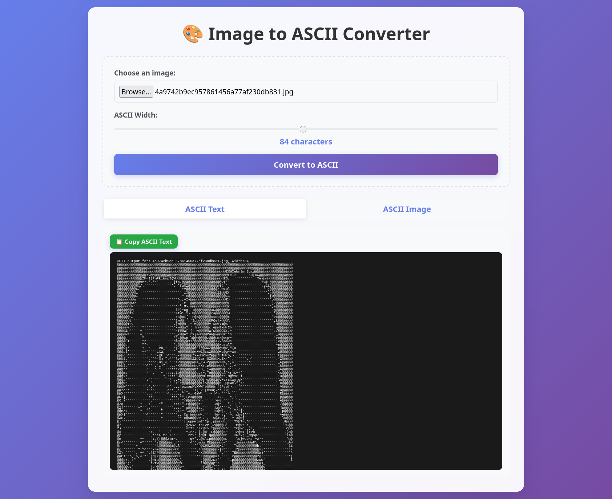

A website for converting images to ASCII, allowing you to copy the ASCII art as text or download it as a JPG

## Personal Project
A practical implementation of a web application with full DevOps stack:
- **Application:** Image to ASCII converter (Flask)
- **Infrastructure:** Docker, Nginx, VPS
- **Monitoring:** Prometheus, Grafana, Node Exporter
